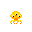
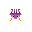

# Projecte pygame

En aquest projecte farem un arcade de naus. 
-----------------------------------------------------------------------------------------------------------------------------------------------------------------------------------------------------------------------------------------------------------------
## - Nau Principal

## - Nau Enemiga

## - Trets Naus 

## - Fons Joc

## - Fons pantalla inici (Galactic Battle)

## - Game Over

## - Vida

## - Enemics 
  

## - Prova finestres
[Space](space.py) / [War](war.py) / [Ocean](ocean.py) / [Zoo](zoo.py)

## Finestres
[Lletra](lletraH.py) / [Escala Colors](escalacolors.py)

## Harry Potter
[Harry Potter](harrypotter.py)

## Musica Joc Arcade
[Musica](MusicaArcade.mp3)

## Pantalla Inici
[Pantalla Inici](PantallaInici.py)

## Pantalla Joc
[Pantalla Joc](PantallaJoc.py)
