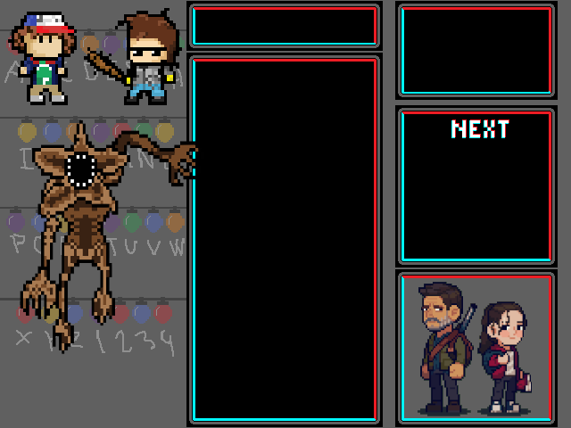

# Projecte pygame

En aquest projecte farem un tetris. 
-----------------------------------------------------------------------------------------------------------------------------------------------------------------------------------------------------
## - Piezas Tetris 

## - Fondo Juego

